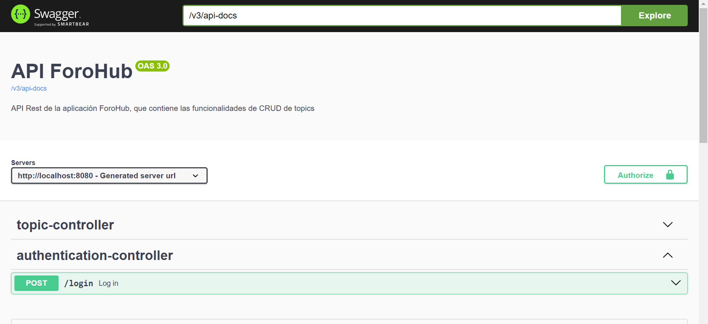
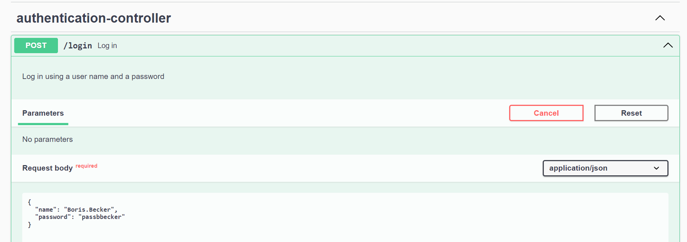
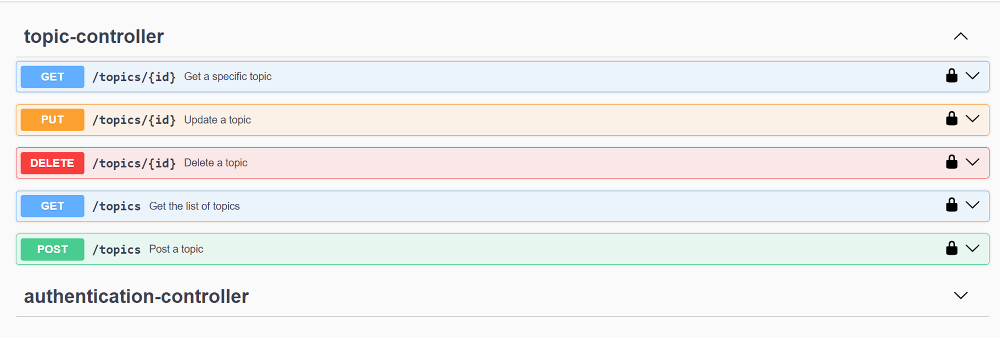
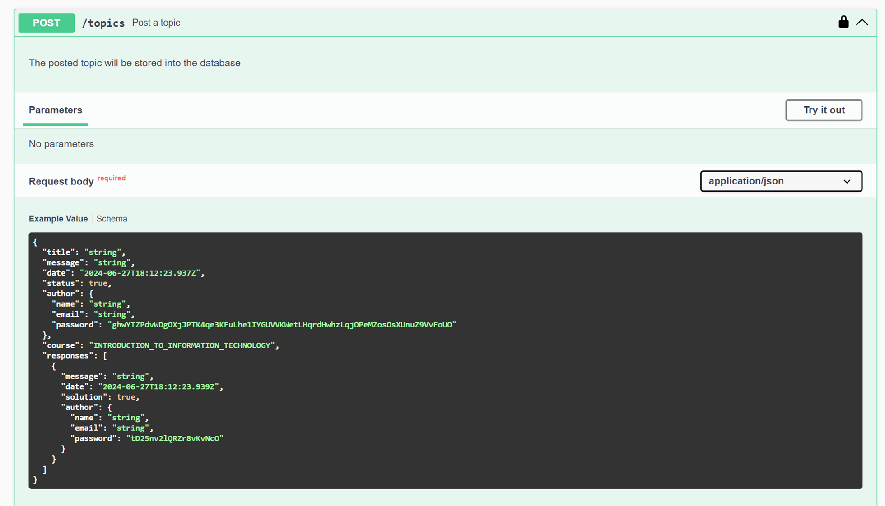
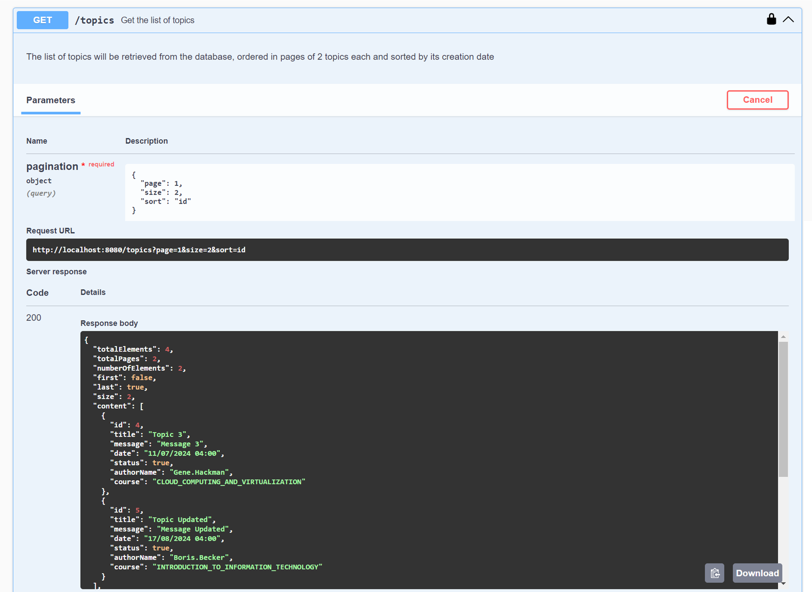
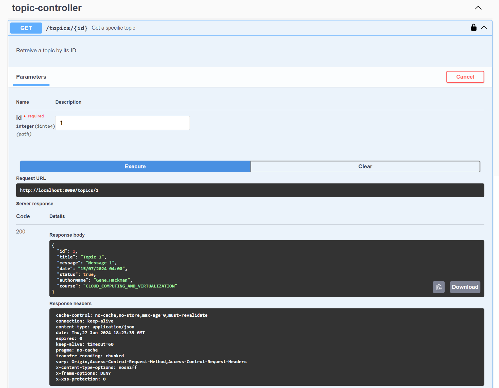
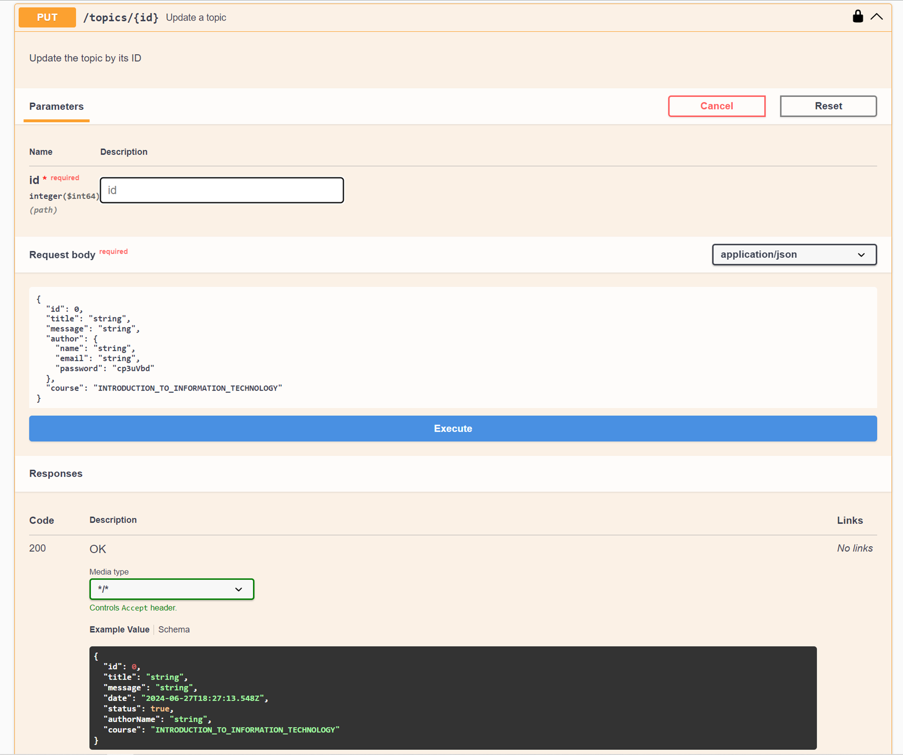
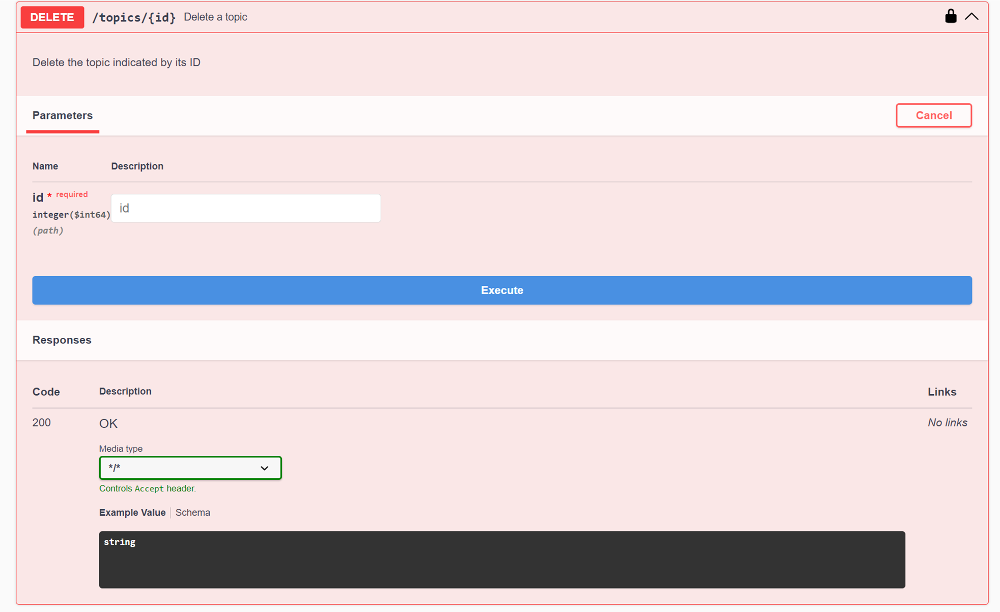
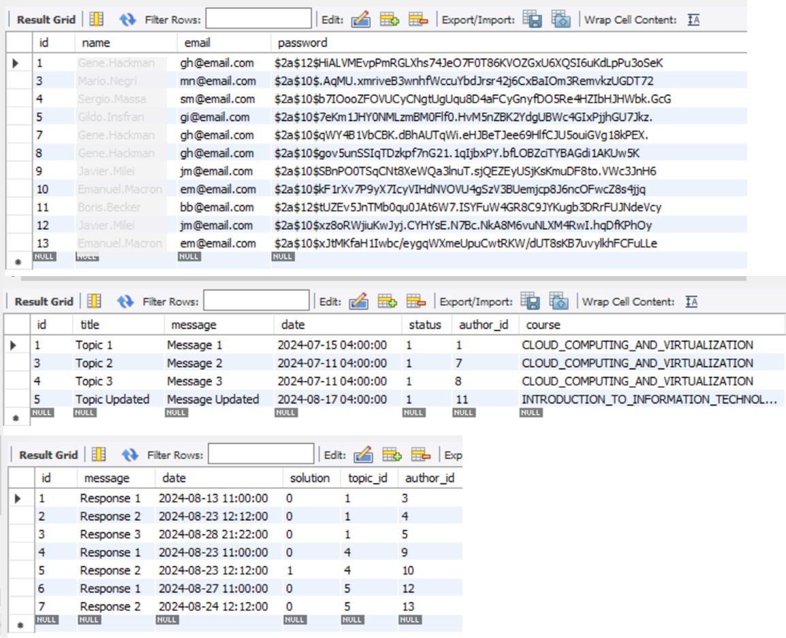

<h1>Challenge 3 - ForoHub - API Rest Stateless</h1>

<h3>Final BACKEND challenge for oracle next
education + alura latam backend course. Using Java, Spring
boot, Spring Security framework, JWT and MySQL database.</h3>

<h4>It consists of a Forum API with CRUD functionalities
that allows to post, update, delete and display topics.
Since it employs spring security, a verified user & password
needs to be previously stored in the database in order 
to have access to operate the CRUD. Passwords are encrypted 
using Bcrypt before being stored, so passwords are never shown.
It uses JWT to grant authorization.</h4>

API usage and docs employing Swagger API:

User login to be allowed to perform CRUD operations:

CRUD operations available in ForoHub API Rest:

Posting a topic:

Obtaining a list of topics:

Obtaining a topic specifying its ID:

Updating a specific topic by its ID:

Deleting a topic by its ID:

Sample of data stored in the database, tables <b>Users</b>,
<b>Topics</b> and <b>Responses</b>

